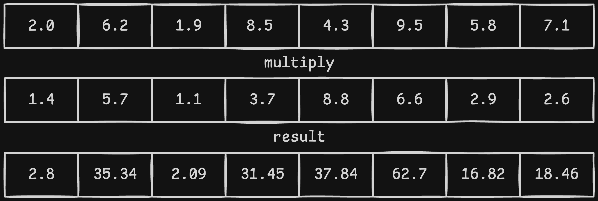

<!-- new_lines: 10 -->
What is SIMD?
---

When Go 1.26 released - they released something interesting under the experimental tag.

**archsimd** library containing SIMD operations!

SIMD: Single instruction multiple data

<!-- end_slide  -->

<!-- new_lines: 10 -->
Problem
---

<!-- column_layout: [1,1] -->

<!-- column: 0 -->

# Now the problem that modern cpus face is that cpu clock rate has stagnated.

## So if we take scalar approach to executing instruction. For example float multiplication.

### Here we take two numbers and we multiply them right - which is fine and dandy.

#### But designers long ago (literally) asked a question
> "What if we could theoretically widen the operation so that developers could place more data on one instruction?"

<!-- column: 1 -->


<!-- end_slide -->

<!-- new_lines: 10 -->

And they did!
---

We got:
- `XMM0–XMM15` which has the width of `128 bits`
- `YMM0–YMM15` which has the width of `256 bits`
- `ZMM0–ZMM31` which has the width of `512 bits`

Lets take 256 bits for example...

We have a float which is 4 bytes == 32 bits which means we have place  8 floats into 256 bits wide instruction right?




**SIMD** shines on **data-parallel** workloads — operations where you apply the same transformation to every element of a large array.

Image processing, audio DSP, physics simulations, matrix math, cryptography, text search (finding bytes in a buffer), and vector similarity search all fit this pattern.


<!-- end_slide -->

Go announced fantastic news that they are working on SIMD standard library and they have put it out for testing under the experimental flag.

It works only for `amd64` architecture for now.

I prepared a short demonstration but we are using XOR which is heavily used in cryptography.



where we can first checkout how the scalar operation would look like:

```go
func XORScalar(destination, plaintext, keystream []byte) {
	for i := range plaintext {
		destination[i] = plaintext[i] ^ keystream[i]
	}
}
```

Pretty straight forward!

Now lets look at SIMD Vector optimized code

```go
// XORSimd256 applies a repeating keystream over plaintext using 256-bit (32-byte)
// SIMD vectors. Each VPXOR instruction XORs 32 bytes in a single cycle.
//
// This means the CPU can XOR 96 bytes per clock cycle with 256-bit vectors.
func XORSimd256(destination, plaintext, keystream []byte) {
	n := len(plaintext)
	i := 0

	// Process 32 bytes at a time using AVX2 VPXOR
	for i+32 <= n {
		p := archsimd.LoadUint8x32((*[32]byte)(plaintext[i : i+32]))
		k := archsimd.LoadUint8x32((*[32]byte)(keystream[i : i+32]))
		r := p.Xor(k)

		// r holds the XOR result in a SIMD register (a CPU vector register, not memory).
		// .Store() writes those 32 bytes from the register back into the destination slice in main memory.
		// Without it, the result would just be discarded when the register gets reused.
		r.Store((*[32]byte)(destination[i : i+32]))
		i += 32
	}

	// Handle remaining bytes (< 32) with scalar fallback
	for ; i < n; i++ {
		destination[i] = plaintext[i] ^ keystream[i]
	}
}
```


And the results were stunning! Even as I ran it on a Macbook where we lost some performance due to architecture miss-match!

You can run it for yourselves and test the results out!

Here are mine:




Bottomline is that Go dev team is working on something great I think. It is a step in the right direction in my opinion! We don't need custom for loops in my opinion...

But for those sweet low level optimisations where you squeeze everything out of the hardware - this is a great step forward!
