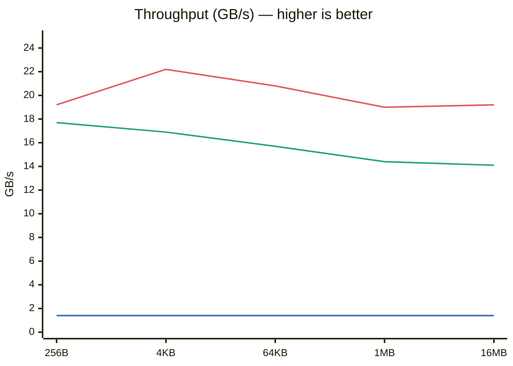

What is SIMD?
---

<!-- pause -->

When Go 1.26 landed, one experimental package quietly made the release notes:

> **`archsimd`** — a standard library for SIMD operations.

<!-- pause -->

# SIMD stands for

**S**ingle **I**nstruction **M**ultiple **D**ata

<!-- pause -->

A way to apply one operation to many values **simultaneously** — using the full width of the CPU's vector registers.

<!-- end_slide -->

The Problem
---

<!-- column_layout: [3, 2] -->

<!-- column: 0 -->

# CPU clock speed has stagnated.

If you multiply floats one at a time — the scalar approach — you're leaving most of the hardware idle.

## Each instruction handles a single pair.

Designers asked:

> *"What if we could widen the operation and pack more data into a single instruction?"*

<!-- column: 1 -->


<!-- reset_layout -->

<!-- end_slide -->

The Answer: Vector Registers
---

<!-- pause -->

They built progressively wider registers:

| Register set  | Width    | Floats (f32) | Integers (i32) | Integers (i64) |
|:-------------|:---------|:-------------|:---------------|:---------------|
| `XMM0–XMM15` | 128 bits | 4 ×          | 4 ×            | 2 ×            |
| `YMM0–YMM15` | 256 bits | 8 ×          | 8 ×            | 4 ×            |
| `ZMM0–ZMM31` | 512 bits | 16 ×         | 16 ×           | 8 ×            |


<!-- pause -->


<!-- pause -->

# SIMD shines on **data-parallel** workloads

Image processing · Audio DSP · Physics · Matrix math · Cryptography · Text search · Vector similarity

<!-- end_slide -->

Go + SIMD: `archsimd`
---

<!-- pause -->

Go's dev team shipped an experimental SIMD standard library.

- Currently `amd64` only
- Lives under the experimental flag

<!-- pause -->

# The demo: **XOR cipher**

XOR is a core primitive in cryptography — applying a keystream byte-by-byte over plaintext.



<!-- end_slide -->

Scalar Baseline
---

```go
func XORScalar(destination, plaintext, keystream []byte) {
    for i := range plaintext {
        destination[i] = plaintext[i] ^ keystream[i]
    }
}
```

<!-- pause -->

Clean and simple.

One XOR per loop iteration — one byte processed per cycle.

<!-- end_slide -->

SIMD: 256-bit Vector Version
---

```go
// XORSimd256 processes 32 bytes per instruction using AVX2 VPXOR.
// That's 96 bytes XOR'd per clock cycle with 256-bit vectors.
func XORSimd256(destination, plaintext, keystream []byte) {
    n := len(plaintext)
    i := 0

    for i+32 <= n {
        p := archsimd.LoadUint8x32((*[32]byte)(plaintext[i : i+32]))
        k := archsimd.LoadUint8x32((*[32]byte)(keystream[i : i+32]))
        r := p.Xor(k)

        // Store writes the 32-byte SIMD register result back to memory.
        // Without it the result is discarded when the register is reused.
        r.Store((*[32]byte)(destination[i : i+32]))
        i += 32
    }

    // Scalar fallback for the remaining < 32 bytes
    for ; i < n; i++ {
        destination[i] = plaintext[i] ^ keystream[i]
    }
}
```

<!-- end_slide -->

SIMD: Untrolled 256-bit Vector Version
---

```go
// XORSimd256Unrolled processes 128 bytes per iteration (4x unrolled),
// keeping the SIMD pipeline fully saturated.
// This demonstrates how manual unrolling can help the CPU's out-of-order
// engine overlap loads, XORs, and stores.
func XORSimd256Unrolled(destination, plaintext, keystream []byte) {
	n := len(plaintext)
	i := 0

	// Process 128 bytes per iteration (4 × 32-byte vectors)
	for i+128 <= n {
		p0 := archsimd.LoadUint8x32((*[32]byte)(plaintext[i : i+32]))
		p1 := archsimd.LoadUint8x32((*[32]byte)(plaintext[i+32 : i+64]))
		p2 := archsimd.LoadUint8x32((*[32]byte)(plaintext[i+64 : i+96]))
		p3 := archsimd.LoadUint8x32((*[32]byte)(plaintext[i+96 : i+128]))

		k0 := archsimd.LoadUint8x32((*[32]byte)(keystream[i : i+32]))
		k1 := archsimd.LoadUint8x32((*[32]byte)(keystream[i+32 : i+64]))
		k2 := archsimd.LoadUint8x32((*[32]byte)(keystream[i+64 : i+96]))
		k3 := archsimd.LoadUint8x32((*[32]byte)(keystream[i+96 : i+128]))

		r0 := p0.Xor(k0)
		r1 := p1.Xor(k1)
		r2 := p2.Xor(k2)
		r3 := p3.Xor(k3)

		r0.Store((*[32]byte)(destination[i : i+32]))
		r1.Store((*[32]byte)(destination[i+32 : i+64]))
		r2.Store((*[32]byte)(destination[i+64 : i+96]))
		r3.Store((*[32]byte)(destination[i+96 : i+128]))

		i += 128
	}

	// Remaining full 32-byte blocks
	for i+32 <= n {
		p := archsimd.LoadUint8x32((*[32]byte)(plaintext[i : i+32]))
		k := archsimd.LoadUint8x32((*[32]byte)(keystream[i : i+32]))
		r := p.Xor(k)
		r.Store((*[32]byte)(destination[i : i+32]))
		i += 32
	}

	// Scalar tail
	for ; i < n; i++ {
		destination[i] = plaintext[i] ^ keystream[i]
	}
}
```

<!-- end_slide -->

Results
---

<!-- pause -->

The numbers were **significant** — even on a MacBook where the architecture mismatch costs some performance.

<!-- end_slide -->

Benchmark: Throughput
---

<span style="color: #3266ad">■ Scalar</span>  <span style="color: #1D9E75">■ SIMD 256</span>  <span style="color: #e05252">■ SIMD unrolled</span>




<!-- end_slide -->

Benchmark: Latency
---

Logarithmic scale — lower is better.

| Payload | Scalar   | SIMD 256  | SIMD Unrolled |
|:--------|----------:|----------:|--------------:|
| 256B    | 187 ns    | 14 ns     | **13 ns**     |
| 4KB     | 2.9 µs    | 243 ns    | **185 ns**    |
| 64KB    | 47.5 µs   | 4.2 µs    | **3.2 µs**    |
| 1MB     | 768 µs    | 72.8 µs   | **55.1 µs**   |
| 16MB    | 12.3 ms   | 1.19 ms   | **0.87 ms**   |


The flat scalar line on the throughput chart (~1.4 GB/s vs 22 GB/s peak) is actually perfect — it visually hammers the point home without saying a word.

<!-- pause -->

Run the benchmarks yourself and see.

<!-- end_slide -->

Takeaway
---

<!-- pause -->

# Go is moving in the right direction

No more hand-rolled assembly or compiler hints just to get vector performance.

<!-- pause -->

## `archsimd` is experimental — but the intent is clear

The dev team wants ergonomic, safe access to what the hardware already offers.

<!-- pause -->

## For data-parallel workloads, this matters

If you're squeezing the last cycles out of image pipelines, crypto primitives, or similarity search — this is the API you've been waiting for.

